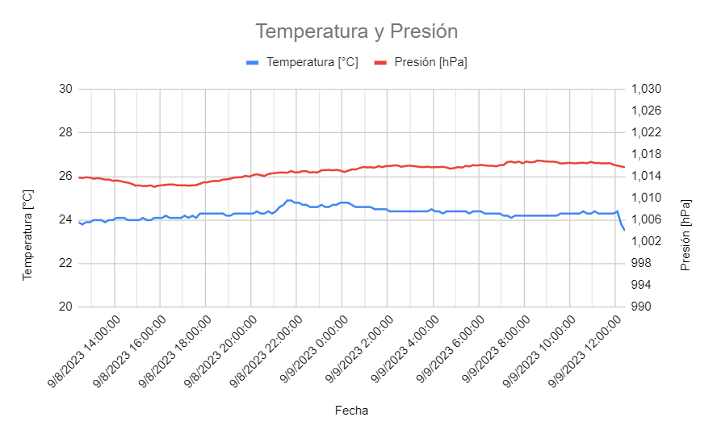

# Calidad de aire interior
Seamos realistas, los dispositivos que miden la calidad de aire se han convertido en estos días en un commodity para el hogar. Pero, ¿Si decimos que tenemos algo que no solo es práctico sino que ayuda a la energía del hogar? Si, no es más ni menos que un complemento de [Fmart | Heladera inteligente](https://github.com/lcismondi/HeladeraSmart).

Equipado con sensores de alta calidad, airbit es el compañero ideal para identificar el ambiente de trabajo en el que se encuentra funcionando la heladera y así complementar su estimación. Es un dispositivo muy sencillo con feedback intuitivo, que además permite saber cuándo es el momento de abrir una ventana y tomar un poco de aire fresco.

## Mucho más que un simple monitor de calidad del aire
Sensor de medioambiente (Temperatura, presión, VOC).
Botones de interacción
Luces de estado

## Especificación técnica
* Tensión de alimentación 12V CC, no requiere batería (debe estar siempre conectado).
* ESP8266 @160MHz
* 32KB de RAM interna y 4MB flash externa
* Tensión de operación segura entre 3.3 y 5V
* Programado en C++
* WIFI 802.11 b/g/n
* Potencia de salida de +19.5dBm en modo 802.11b

## Sensores
* Calidad de aire (MQ-135)
* Presión y Temperatura (BMP085)

## Feedback
* 4 pulsadores
* Luces WS2812

## Lectura de variables en tiempo real
Para quienes tienen la necesidad de sumergirse en el mundo de los datos airbit también lo tiene. Con solo conectarlo a una red wifi podrán ver los números y estadísticas.

## Hackeable 100%
El corazón de airbit corre con un ESP8266 en sus versiones Node MCU v2 o v3. Es un poderoso microcontrolador que le da vida al monitor de ambiente y la mejor parte es que cualquier con conocimientos básicos se puede conectar.

Es la primer herramienta que dejo disponible para que otros creadores se puedan sumar al proyecto y tengan la libertad de apoyar el proyecto, creando e innovar sin restricciones innecesarias, ya sea jugando en un sótano o construyendo la próxima gran versión.

## Redes
* [Instagram](https://www.instagram.com/stories/highlights/17906926166257568/)
* [Web](https://www.lucianocismondi.com.ar/2023/04/airbit-calidad-de-aire-interior.html) 
