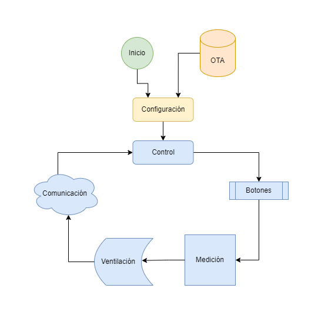

# Funcionamiento del Firmware
se ejecuta en el microcontrolador ESP8266 y sigue un ciclo de funcionamiento básico:
* Inicialización: El firmware inicializa los componentes necesarios, como los sensores y la base lumínica.
* Adquisición de datos: Se leen los valores de los sensores para obtener mediciones ambientales actualizadas.
* Procesamiento de datos: Los datos obtenidos se procesan para calcular la calidad del aire y otros parámetros relevantes.
* Interacción con el usuario: Se manejan las interacciones del usuario a través de los pulsadores y se actualiza la base lumínica según sea necesario.
* Conexión a la base de datos: Se establece una conexión Wi-Fi con la base de datos para informar y almacenar las lecturas actuales.
* Ciclo de espera: Espera un período de tiempo antes de repetir el ciclo de funcionamiento para conservar energía y prolongar la vida útil del dispositivo.

# Características del Firmware
* Adquisición de datos: El firmware se encarga de la lectura de los sensores BMP085, BMP180 y MQ135 para obtener mediciones precisas de presión y calidad del aire.
* Procesamiento de datos: Los datos recopilados por los sensores son procesados para calcular la calidad del aire y otros parámetros ambientales relevantes.
* Control de la base lumínica: Controla la base lumínica con WS2812 para proporcionar retroalimentación visual al usuario, como indicadores de estado y alertas.
* Interacción con pulsadores: Se gestionan los pulsadores integrados en la carcasa, permitiendo acciones como cambiar el modo de visualización o activar alarmas.
* Conexión a una base de datos: Se conecta a una base de datos por Wi-Fi para informar y almacenar el historial de lecturas, lo que permite un seguimiento detallado de la calidad del aire a lo largo del tiempo.

# Personalización del Firmware
El firmware Airbit se puede personalizar para adaptarse a diferentes necesidades y preferencias. Algunas formas de personalización incluyen:
* Ajuste de parámetros: Es posible ajustar los parámetros de configuración, como los umbrales de calidad del aire o los intervalos de muestreo de los sensores.
* Añadir nuevas características: Se pueden agregar nuevas funcionalidades al firmware, como la integración con servicios en la nube o la implementación de algoritmos de análisis de datos más avanzados.
* Optimización del rendimiento: Se pueden realizar optimizaciones en el código para mejorar el rendimiento y la eficiencia energética del dispositivo.
