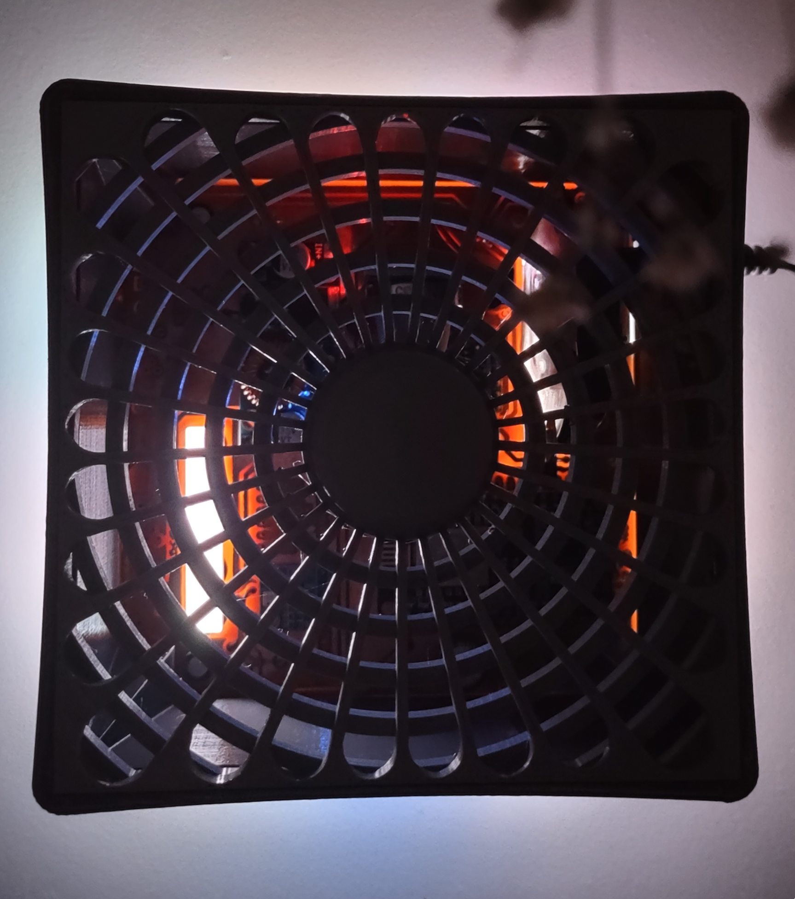

La carcasa está montada desde un eje central el cual le permite flexibilidad al conjunto. De tal forma que en los vértices se encuentrn los botones de interacción. Al hacer una leve presión sobre las esquinas el cubo se presionan los botones del PCB que hace de base del cubo para cerrar el gabinete.
Por la parte superior, tiene una rejilla en gran parte de su extensión para maximizar la ventilación e intercambio del ambiente que se está monitorizando.

